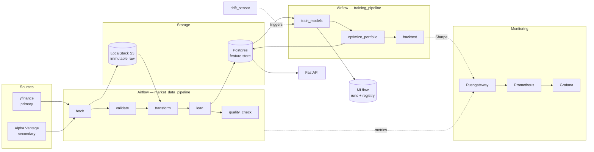

# QuantFolio

A point-in-time-correct market data platform for quantitative research.

The hard part of quant research infrastructure is not computing an RSI — it is
guaranteeing that the number you computed for 16 March 2020 used only what was
knowable on 16 March 2020. This project is built around that guarantee, and
around proving it rather than asserting it.

**Status:** Phases 1 (data platform) and 2 (research layer) complete. Phase 3
(serving) is planned — see [Roadmap](#roadmap).

---

## Architecture



Raw vendor responses land in S3 and are never edited. Everything in Postgres is
derived from them, so any transform bug can be fixed and replayed without
re-hitting a rate-limited API.

---

## Quickstart

Requires Docker and Docker Compose.

```bash
cp .env.example .env
make up
```

Then unpause and trigger the pipeline:

```bash
make trigger
```

| Service | URL | Credentials |
|---|---|---|
| Airflow | http://localhost:8080 | `airflow` / `airflow` |
| API docs | http://localhost:8000/docs | — |
| MLflow | http://localhost:5000 | — |
| Grafana | http://localhost:3000 | `admin` / `admin` |
| Prometheus | http://localhost:9090 | — |

Verify data landed:

```bash
curl "http://localhost:8000/features/AAPL?start=2024-01-01"
```

Train both frameworks and print the comparison table:

```bash
make train
```

Run the tests:

```bash
make test
```

---

## Design decisions

### Causal transforms, and a test that proves it

The tempting way to handle outliers is to compute a mean and standard deviation
over the whole series and clip beyond N sigma. That leaks: the bound applied in
2016 would depend on prices from 2024, and a backtest over that series is
quietly reading the future.

Every transform here uses trailing windows only — `.rolling()`, `.ewm()`, or a
positive `.shift()`. Outliers are clipped against a **rolling median ± k·MAD**,
using median and MAD rather than mean and standard deviation because the
statistic has to be robust to the very outliers it is detecting.

The guarantee is checked empirically in
[`tests/test_no_lookahead.py`](tests/test_no_lookahead.py): perturb a price on
day *t*, recompute, and assert that no feature dated before *t* moved. There is
a companion test asserting the perturbation *does* change day *t* itself, so the
suite cannot pass vacuously on a frame of NaNs. A third test recomputes features
on a truncated history and requires bit-identical output for the overlapping
dates — which is precisely what a live system would have produced.

The single intentional forward shift in the codebase creates the **label**
(`next_day_log_return`), never a feature, and its last row is NaN by
construction.

### Why S3 *and* Postgres

They answer different questions. S3 holds immutable, replayable raw: the record
of what each vendor actually said, partitioned
`raw/{source}/{ticker}/{date}.parquet` and written once — a retry deliberately
does not overwrite it. Postgres holds structured, queryable features with a
schema and constraints. If the feature logic has a bug, the fix is a code change
and a replay, not a re-fetch.

### Idempotency is structural, not disciplinary

Every fact table is keyed on `(ticker, date)` and there is exactly one write
path — `upsert()` in [`storage/db.py`](src/quantfolio/storage/db.py) — which
issues `INSERT ... ON CONFLICT (ticker, date) DO UPDATE`. A task that retries,
or a backfill re-running an old date, overwrites its own rows and touches
nothing else. No individual task has to remember to be careful.

Each run also fetches its own warm-up window rather than depending on what a
previous run left behind, so any execution date can be re-run in isolation and a
backfill needs no particular ordering.

### Why Pushgateway

Prometheus scrapes; Airflow tasks exit. A task that ran for forty seconds is
gone long before the next scrape interval, so there is nothing to pull from.
Batch jobs push their metrics on completion and Prometheus scrapes the gateway
instead. Pushes are best-effort — a monitoring outage must never fail a data
pipeline.

### Exchange calendars, not blind forward-fill

Forward-filling across a date range invents bars for weekends and holidays,
which then feed rolling windows and corrupt every downstream statistic. The
calendar decides which sessions should exist; only genuinely missed sessions are
filled, each one flagged `is_imputed`, with volume set to zero rather than
carried forward. Gaps longer than five sessions are left as NaN for the quality
check to fail on, because a two-week hole is a data problem to surface, not one
to paper over with a stale price.

### Failures are data

A delisted ticker or an exhausted rate limit must not cost the other thirteen
symbols their data. Sources return a `FetchResult` rather than raising;
per-ticker failures are recorded in `ingestion_log` and the run continues. Only
a total failure — no ticker fetched at all — fails the task. Retries use
exponential backoff and distinguish transient errors (rate limits, 5xx) from
permanent ones (unknown symbol), because retrying the latter just burns a quota
that resets tomorrow.

Alpha Vantage's free tier signals throttling with an HTTP 200 containing a
`Note` key rather than a 429, which is why that client inspects the payload
before parsing it.

### Returns, not prices

The models predict the **next-day log return**. Predicting the price level
produces a flattering, meaningless MSE: prices are near-random walks, so
"tomorrow looks like today" scores superbly and says nothing. A return target
has no such autocorrelation to lean on, which is why the errors it produces are
small, honest, and comparable across models.

### Two frameworks, because they answer different questions

The **TensorFlow/Keras dense MLP is the named baseline**: it sees one day at a
time, with no memory. The **PyTorch LSTM is the challenger**, and its entire
claim is that a trailing sequence carries information a single snapshot does
not. If the LSTM cannot beat the MLP, that claim is not supported — which makes
the comparison an engineering decision rather than two logos on a page.

Keras handles the dense baseline with the least ceremony; PyTorch's explicit
training loop keeps the sequence handling and early stopping visible, which
matters when the question is *why* one won. Both implement the same interface
and run through identical folds, so the only difference is the model.

Every result is reported next to the **zero-prediction baseline** — the MSE of
predicting 0.0 every day. This is what makes "X% lower MSE" a statement rather
than a number: lower than the Keras baseline, out-of-sample, walk-forward, with
the zero-prediction bar shown alongside. A model that does not clear that bar is
reported as such and is not registered.

### Walk-forward, and the scaling trap

Splits are expanding-window walk-forward, never random: each fold trains on a
contiguous past and tests on the future immediately after. Splits are taken over
**dates, not rows**, because a row-based split on a multi-ticker panel would put
AAPL's 3 March in training and MSFT's 3 March in test, leaking the regime.

The subtler leak is scaling. Fitting a scaler on the whole panel hands the model
the test period's mean and variance before it sees a single test row, so
`fit_scaler` is fit on the training fold alone. The target is standardized the
same way — daily returns are order 1e-2, and an unscaled target makes a freshly
initialised network spend its training budget shrinking its output instead of
learning. Predictions are inverted immediately, so every reported metric is in
raw return units.

Each fold also gets a **fresh model**. Carrying weights forward would warm-start
later folds on their own past and quietly flatter them.

### Why shrinkage

Markowitz's practical problem is the covariance estimate, not the optimization.
The sample covariance of N assets from T observations has badly biased extreme
eigenvalues — the smallest are too small — and the optimizer dutifully piles into
whichever direction the estimate got most wrong. That is the error-maximisation
critique, and it is why naive mean-variance portfolios so often lose to equal
weighting out of sample.

**Ledoit-Wolf shrinkage** pulls the sample covariance toward a structured target
by an analytically chosen intensity — not a tuned hyperparameter. The result is
better conditioned, always invertible, and more stable period to period, which
also means less turnover and lower costs. The long-only constraint and the 30%
per-asset cap bound the damage from a single bad estimate the same way.

The backtest reports the optimizer against **equal weight**, which estimates
nothing and therefore has no estimation error to amplify. It is a famously hard
baseline, and if shrinkage cannot beat it net of costs, that is the finding.

### Costs and the one-day lag

The backtest is deliberately pessimistic in two ways. Transaction costs are
charged on turnover at 10 bps per side, because a strategy that rebalances to a
fast-moving optimum can look excellent gross and lose money net — reporting only
gross Sharpe is the easiest way to build a strategy that dies at the broker.

And weights computed from data through the close on day *t* are applied on *t+1*.
Skipping that lag manufactures a spectacular Sharpe from nothing;
`test_backtest.py` demonstrates it by giving a portfolio perfect foresight and
showing its Sharpe collapse from 8.1 to 0.6 once the lag is applied.

### What triggers retraining

The drift sensor compares recent rolling out-of-sample MSE against the model's
**own** training-time MSE, so an intrinsically noisy model is not permanently
"drifting". A breach must persist for three consecutive days: daily return error
is noisy enough that firing on a single bad day would produce a retraining loop.

A monitoring rule nobody has seen trigger is a rule nobody should trust, so
`scripts/inject_drift.py` injects synthetic degradation and runs the real
detector against it, checking both directions — it fires on drift and stays
quiet on clean data:

```bash
make drift
```

---

## Layout

```
config/universe.yml           tickers and feature windows — config, not code
src/quantfolio/
  ingestion/                  sources, retry/backoff, fallback
  storage/                    schema, the single upsert path, immutable S3 raw
  transforms/                 calendar alignment, causal cleaning, features
  quality/                    schema, null, continuity and range checks
  metrics/                    Pushgateway helpers
  api/                        FastAPI routers
  models/                     walk-forward splits, both models, MLflow, drift
  portfolio/                  cvxpy optimizer, cost-adjusted backtest
  pipeline.py                 Phase 1 task bodies, testable without Airflow
  research_pipeline.py        Phase 2 task bodies
dags/
  market_data_pipeline.py     fetch -> validate -> transform -> load -> quality
  training_pipeline.py        train -> optimize -> backtest
  drift_sensor.py             rolling OOS MSE breach -> trigger retraining
monitoring/                   Prometheus config, provisioned Grafana dashboards
scripts/                      backfill, train, inject_drift
tests/                        including test_no_lookahead.py
```

The DAGs are deliberately thin: all logic lives in `pipeline.py` and
`research_pipeline.py`, so everything can be tested and run without a scheduler
via `scripts/backfill.py` and `scripts/train.py`.

Grafana dashboards are provisioned from JSON in the repo rather than clicked
together in the UI, so they are reviewable and survive a volume wipe.

---

## API

| Endpoint | Purpose |
|---|---|
| `GET /health` | Liveness plus data freshness — a service backed by a store that stopped updating a week ago is not healthy |
| `GET /prices/{ticker}` | Daily OHLCV, optional `start` / `end` / `limit` |
| `GET /features/{ticker}` | Engineered features, optional `start` / `end` / `limit` |

---

## Testing

```bash
make test        # everything
make test-fast   # skip live Postgres and real network training
make test-slow   # only the tests that train real networks
```

209 tests pass with no infrastructure running. The Postgres integration tests
skip cleanly when no database is reachable, and run against the real thing once
`make up` is going.

Four files carry most of the weight:

- **`test_no_lookahead.py`** — the causality proof described above.
- **`test_upsert_idempotency.py`** — two layers. Compiled-SQL assertions verify
  the write path really emits `ON CONFLICT (ticker, date) DO UPDATE` and run
  anywhere; live-Postgres tests load the same data twice and assert the row
  count did not move.
- **`test_walk_forward.py`** — train folds strictly precede test folds, splits
  are by date rather than row, scalers are fit on training data only, and
  sequences never span a ticker boundary.
- **`test_backtest.py`** — costs reduce returns, turnover is one-way, and the
  one-day lag destroys a clairvoyant portfolio's free lunch.

---

## Results

Fill this in from your own run — `make train` prints the table. Report it as
printed, including the `beats_baseline` column.

The expected outcome on daily equity returns is that neither model reliably
beats the zero-prediction baseline. Daily returns are close to unforecastable
from technical features alone, and a system honest enough to say so is worth
more than one tuned until a number looks good. The pipeline is the product; the
model is the workload.

---

## Roadmap

**Phase 3 — serving.** Prediction and portfolio endpoints, a locust load test so
any latency figure is measured rather than guessed, a Sharpe gauge in Grafana,
and Terraform applied against LocalStack.

The honest framing throughout: the pipeline is the product, the model is the
workload. This system is built to measure a strategy truthfully, not to claim
one works.
