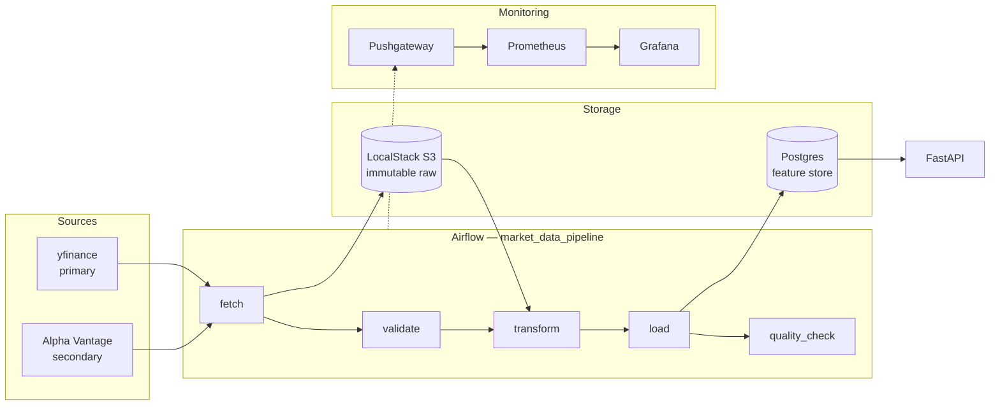

# QuantFolio

A point-in-time-correct market data platform for quantitative research.

The hard part of quant research infrastructure is not computing an RSI — it is
guaranteeing that the number you computed for 16 March 2020 used only what was
knowable on 16 March 2020. This project is built around that guarantee, and
around proving it rather than asserting it.

**Status:** Phase 1 (data platform) complete. Phases 2 (modelling) and 3
(serving) are planned — see [Roadmap](#roadmap).

---

## Architecture



Raw vendor responses land in S3 and are never edited. Everything in Postgres is
derived from them, so any transform bug can be fixed and replayed without
re-hitting a rate-limited API.

---

## Quickstart

Requires Docker and Docker Compose.

```bash
cp .env.example .env
make up
```

Then unpause and trigger the pipeline:

```bash
make trigger
```

| Service | URL | Credentials |
|---|---|---|
| Airflow | http://localhost:8080 | `airflow` / `airflow` |
| API docs | http://localhost:8000/docs | — |
| Grafana | http://localhost:3000 | `admin` / `admin` |
| Prometheus | http://localhost:9090 | — |

Verify data landed:

```bash
curl "http://localhost:8000/features/AAPL?start=2024-01-01"
```

Run the tests:

```bash
make test
```

---

## Design decisions

### Causal transforms, and a test that proves it

The tempting way to handle outliers is to compute a mean and standard deviation
over the whole series and clip beyond N sigma. That leaks: the bound applied in
2016 would depend on prices from 2024, and a backtest over that series is
quietly reading the future.

Every transform here uses trailing windows only — `.rolling()`, `.ewm()`, or a
positive `.shift()`. Outliers are clipped against a **rolling median ± k·MAD**,
using median and MAD rather than mean and standard deviation because the
statistic has to be robust to the very outliers it is detecting.

The guarantee is checked empirically in
[`tests/test_no_lookahead.py`](tests/test_no_lookahead.py): perturb a price on
day *t*, recompute, and assert that no feature dated before *t* moved. There is
a companion test asserting the perturbation *does* change day *t* itself, so the
suite cannot pass vacuously on a frame of NaNs. A third test recomputes features
on a truncated history and requires bit-identical output for the overlapping
dates — which is precisely what a live system would have produced.

The single intentional forward shift in the codebase creates the **label**
(`next_day_log_return`), never a feature, and its last row is NaN by
construction.

### Why S3 *and* Postgres

They answer different questions. S3 holds immutable, replayable raw: the record
of what each vendor actually said, partitioned
`raw/{source}/{ticker}/{date}.parquet` and written once — a retry deliberately
does not overwrite it. Postgres holds structured, queryable features with a
schema and constraints. If the feature logic has a bug, the fix is a code change
and a replay, not a re-fetch.

### Idempotency is structural, not disciplinary

Every fact table is keyed on `(ticker, date)` and there is exactly one write
path — `upsert()` in [`storage/db.py`](src/quantfolio/storage/db.py) — which
issues `INSERT ... ON CONFLICT (ticker, date) DO UPDATE`. A task that retries,
or a backfill re-running an old date, overwrites its own rows and touches
nothing else. No individual task has to remember to be careful.

Each run also fetches its own warm-up window rather than depending on what a
previous run left behind, so any execution date can be re-run in isolation and a
backfill needs no particular ordering.

### Why Pushgateway

Prometheus scrapes; Airflow tasks exit. A task that ran for forty seconds is
gone long before the next scrape interval, so there is nothing to pull from.
Batch jobs push their metrics on completion and Prometheus scrapes the gateway
instead. Pushes are best-effort — a monitoring outage must never fail a data
pipeline.

### Exchange calendars, not blind forward-fill

Forward-filling across a date range invents bars for weekends and holidays,
which then feed rolling windows and corrupt every downstream statistic. The
calendar decides which sessions should exist; only genuinely missed sessions are
filled, each one flagged `is_imputed`, with volume set to zero rather than
carried forward. Gaps longer than five sessions are left as NaN for the quality
check to fail on, because a two-week hole is a data problem to surface, not one
to paper over with a stale price.

### Failures are data

A delisted ticker or an exhausted rate limit must not cost the other thirteen
symbols their data. Sources return a `FetchResult` rather than raising;
per-ticker failures are recorded in `ingestion_log` and the run continues. Only
a total failure — no ticker fetched at all — fails the task. Retries use
exponential backoff and distinguish transient errors (rate limits, 5xx) from
permanent ones (unknown symbol), because retrying the latter just burns a quota
that resets tomorrow.

Alpha Vantage's free tier signals throttling with an HTTP 200 containing a
`Note` key rather than a 429, which is why that client inspects the payload
before parsing it.

---

## Layout

```
config/universe.yml           tickers and feature windows — config, not code
src/quantfolio/
  ingestion/                  sources, retry/backoff, fallback
  storage/                    schema, the single upsert path, immutable S3 raw
  transforms/                 calendar alignment, causal cleaning, features
  quality/                    schema, null, continuity and range checks
  metrics/                    Pushgateway helpers
  api/                        FastAPI routers
  pipeline.py                 the five task bodies, testable without Airflow
dags/market_data_pipeline.py  thin DAG wrapper
monitoring/                   Prometheus config, provisioned Grafana dashboards
tests/                        including test_no_lookahead.py
```

The DAG is deliberately thin: all logic lives in `pipeline.py`, so the pipeline
can be tested and run without a scheduler via `scripts/backfill.py`.

Grafana dashboards are provisioned from JSON in the repo rather than clicked
together in the UI, so they are reviewable and survive a volume wipe.

---

## API

| Endpoint | Purpose |
|---|---|
| `GET /health` | Liveness plus data freshness — a service backed by a store that stopped updating a week ago is not healthy |
| `GET /prices/{ticker}` | Daily OHLCV, optional `start` / `end` / `limit` |
| `GET /features/{ticker}` | Engineered features, optional `start` / `end` / `limit` |

---

## Testing

```bash
make test        # everything
make test-fast   # skip tests needing live Postgres
```

106 tests pass with no infrastructure running. The Postgres integration tests
skip cleanly when no database is reachable, and run against the real thing once
`make up` is going.

Two files carry most of the weight:

- **`test_no_lookahead.py`** — the causality proof described above.
- **`test_upsert_idempotency.py`** — two layers. Compiled-SQL assertions verify
  the write path really emits `ON CONFLICT (ticker, date) DO UPDATE` and run
  anywhere; live-Postgres tests load the same data twice and assert the row
  count did not move.

---

## Roadmap

**Phase 2 — research layer.** A TensorFlow/Keras dense MLP as the named baseline
and a PyTorch LSTM as the sequential challenger, predicting next-day log returns
(not prices — price prediction gives a flattering, meaningless MSE via
autocorrelation) under walk-forward evaluation, with the zero-prediction
baseline reported alongside. Everything logged to MLflow. A cvxpy Markowitz
optimizer using Ledoit–Wolf shrinkage, and a cost-adjusted backtest reporting
gross and net Sharpe.

**Phase 3 — serving.** Prediction and portfolio endpoints, a locust load test so
any latency figure is measured rather than guessed, a Sharpe gauge in Grafana,
and Terraform applied against LocalStack.

The honest framing throughout: the pipeline is the product, the model is the
workload. This system is built to measure a strategy truthfully, not to claim
one works.
